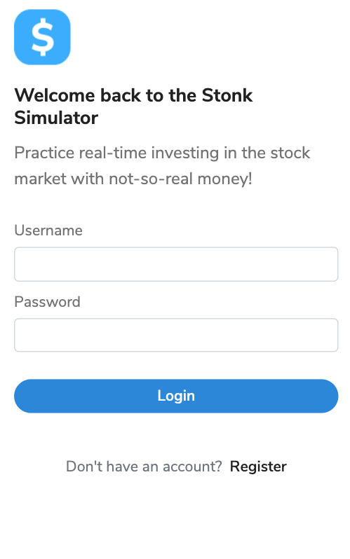
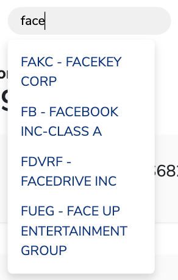
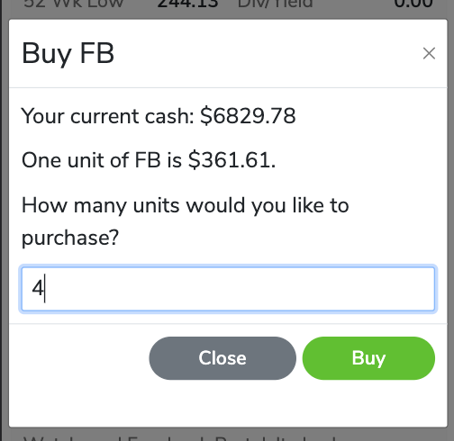
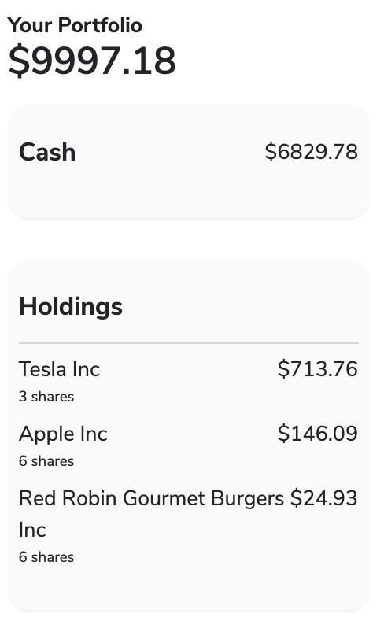
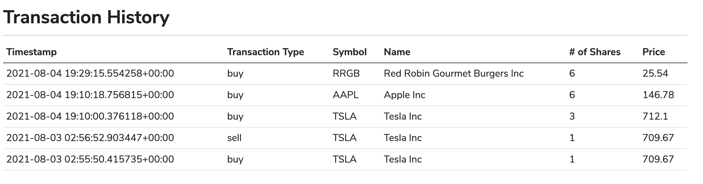

Check out the live site: https://stonk-simulator.herokuapp.com/

# Stonk Simulator

Learn how to trade and invest in stocks with no risk. This stock simulator provides you $10,000 in "cash"
and real-time stock data to help you practice your investing skills before setting out into the real investing world.

## Background 🤑

I was always curious about the stock market. No one ever taught me about it - not even my parents or teachers. And I know a lot of young adults who experience the same thing. As I looked into investing and how to invest in stocks on my own, I realized that the best way to become familiar with it is by actually setting aside money to invest. As an inexperienced young adult, it's a bit risky to do that.

That's what gave me the idea to create this webapp. It takes away that risk of losing any actual money while learning how to invest in stocks. This project aims to bridge the gap between those with little financial knowledge and the world of investing. 

### Learnings
This was my first big project that I worked on and it's safe to say I learned quite a lot (and can apply to future projects). First of all, if things don't go as planned (and they probably won't), be willing to compromise and figure out another solution. For instance, the SQLite database that I used wasn't supported on Heroku so I spent a few days figuring out which other database to use and how to edit my current code to fit the new database in which I used PostgreSQL. Since I built a more complete webapp, a new skill that I learned was performing the different types of testing from unit to functional. I also sharpened my sense of time management as I had to make many decisions on what features I should prioritize on building and which ones to let go due to time restraints. Lastly, what I learned the most was how to be resourceful. I ran into so many bugs and errors throughout this project, and I was able to solve them through manual debugging, skimming through forums, searching through documentation, watching videos, and/or reading article posts.

### Technologies 
For the backend of this project, I used Python with the Flask framework, allowing me to handle forms, routes, and API calls. For the frontend, I used HTML, Bootstrap with some customized CSS, and JavaScript. Data was stored using PostgreSQL. I used these technologies they were easy to use considering I was building a full-blown webapp, thus using frameworks such as Flask and Bootstrap helped to abstract and simplify certain codes.

### Challenges
The biggest challenge that I faced was that this project kept taking longer than I had anticipated. This was because when I planned the project and sketched the webapp's features before building, I didn't consider the many little functionalities that the app needed. What I thought to be a two-week project slowly turned into a month-long project.

## Features ✨

### Personalized Account
Create a personal accout via the registration form allowing you to store your information and login/logout. The Account settings lets you reset your cash and portfolio as well as delete your account.

### Stock Search
Use the search bar to find a stock by the company's name or ticker symbol. You can then view more details about 
that stock including it's current price, price over time through a graph, and it's key stats.

### Buy and Sell
Simply choose which and how many stocks you want to purchase that fits within your cash limit, and easily sell them at any time.  

### Dashboard
Get a clear view of all your holdings, your cash amount, and your portfolio value.

### Transaction History
View all the stocks you have purchased and sold, along with details of the transaction including its timestamp.

## Support 💖

Any questions or concerns? Please send an email to tammyhho98@gmail.com

## Roadmap 🔮

Future releases will include a more modern and smooth UI, as well as expanded user settings and a social feature.
Stay tuned! 

## Author 👩🏻‍💻

Designed and developed by Tammy Ho, 2021. 

Need help on a project or just want to connect? Feel free to contact me via these socials! :)

LinkedIn - https://www.linkedin.com/in/ho-tammy/

Portfolio - https://tammyhho.com/

Email - tammyhho98@gmail.com
